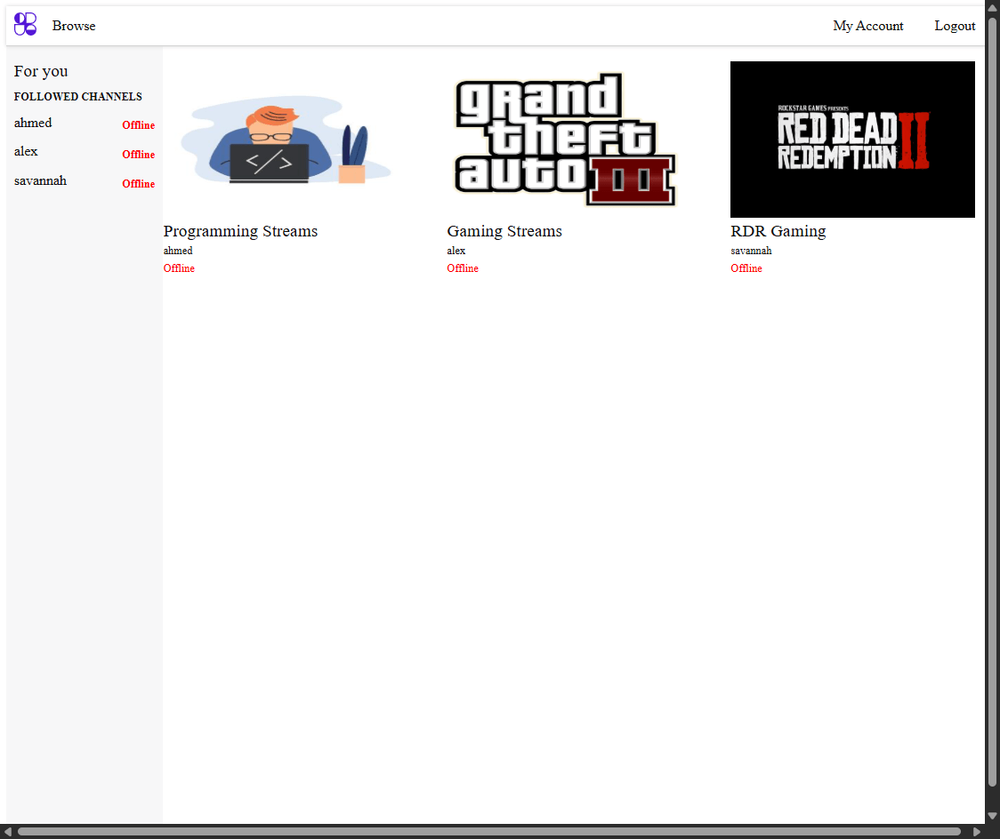
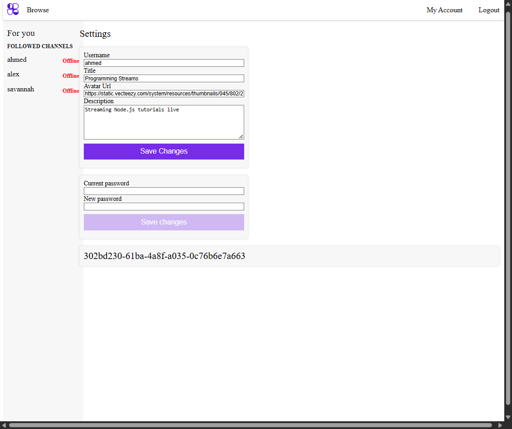
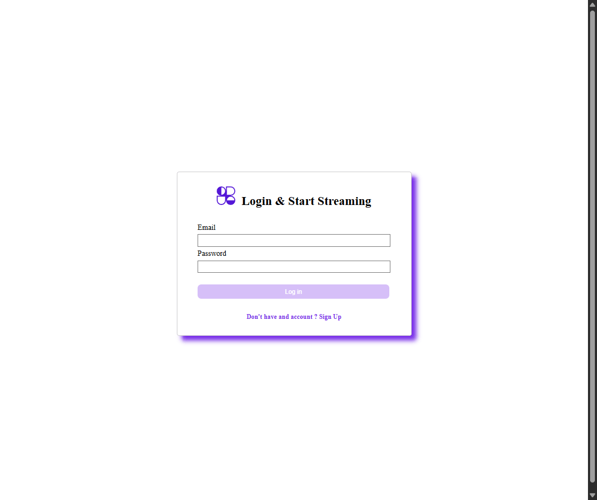
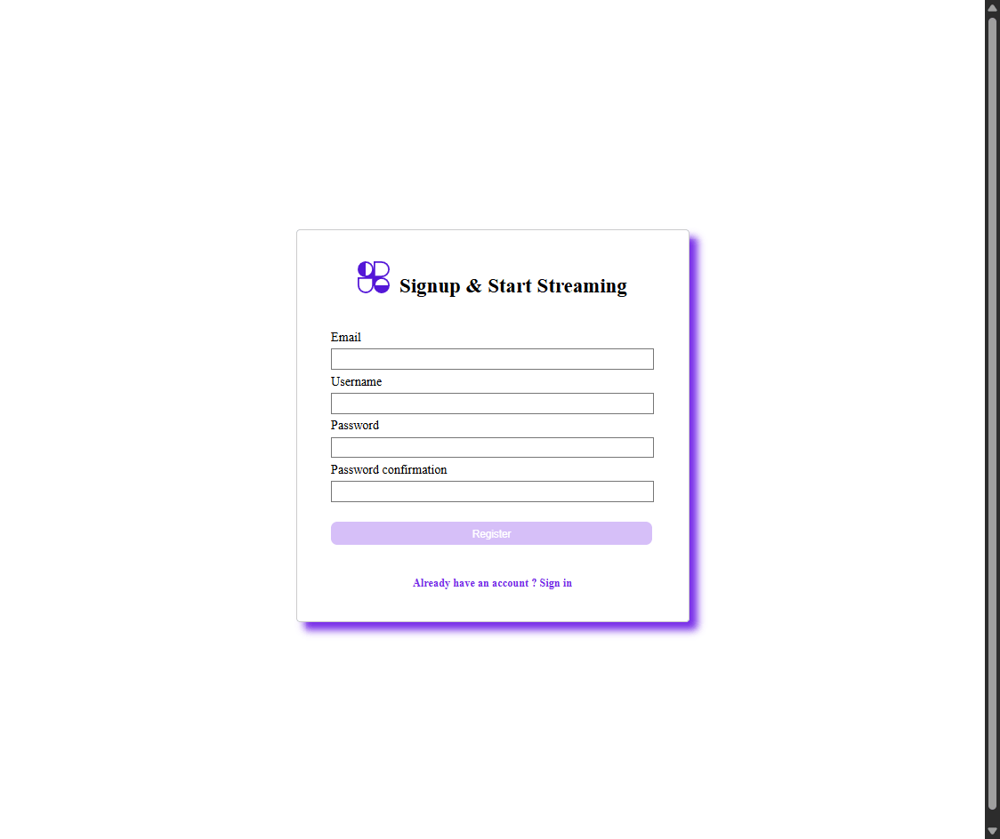
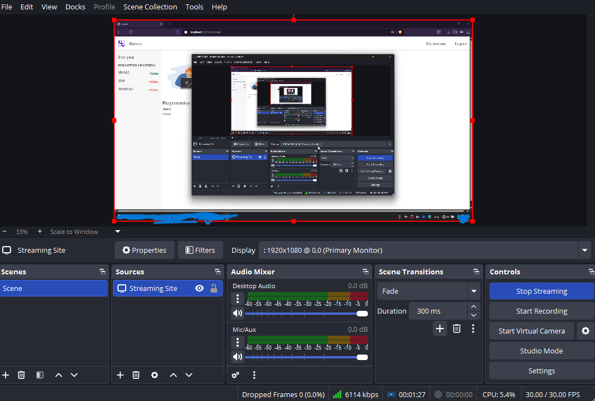
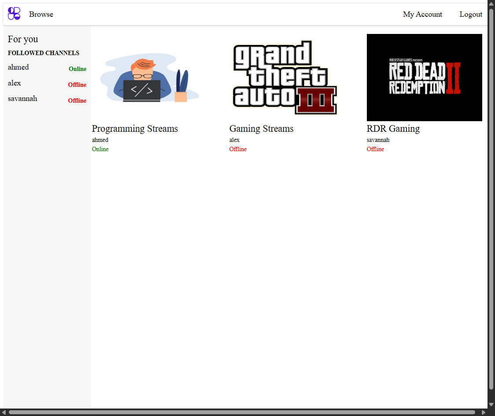

# Full Stack Live Streaming Platform

> A Twitch-inspired MVP that explores the real architecture behind live streaming — built to understand how video, real-time communication, and user systems actually connect at scale.

[](https://reactjs.org/)
[](https://nodejs.org/)
[](https://www.typescriptlang.org/)
[](https://www.mongodb.com/)

---

## Why I Built This

Most streaming tutorials show you how to embed a video player. I wanted to understand what actually happens *before* the video reaches the browser — how broadcasters push streams, how servers ingest and relay them, and how live chat stays in sync with thousands of concurrent viewers.

This project forced me to think in systems rather than features. The hardest decision was separating the RTMP media server from the REST API entirely — they handle fundamentally different traffic patterns and scaling requirements. Getting those two servers to coordinate cleanly (stream key validation, live status sync) taught me more about distributed systems thinking than any course I've taken.

---

## 📸 Screenshots

| Desktop Main Feed | Streamer Dashboard | Live Channel View |
|---|---|---|
|  |  |  |

| Login | Register | OBS Setup |
|---|---|---|
|  |  |  |

| Online Status Indicator |
|---|
|  |

---

## Architecture

This project uses a deliberate three-tier architecture, where each service has a single responsibility:

1. **Client (React + Vite + TypeScript):** UI rendering, HLS video playback, and real-time chat via Socket.io.
2. **API Server (Node + Express + TypeScript):** RESTful operations, JWT authentication, MongoDB interactions, and WebSocket connections for chat.
3. **RTMP Media Server (Node Media Server):** Dedicated ingest server for receiving broadcaster streams and distributing them as HLS. Completely decoupled from the API layer.

The separation between the API server and RTMP server is intentional — in production, these would scale independently based on traffic type (API requests vs. video bandwidth).

---

## Features

### Completed
- **Authentication** — Secure registration and login using JWT with protected routes
- **Channel Browsing** — Dynamic grid of all active streaming channels
- **Follow System** — Subscribe/unsubscribe to channels with persistent state
- **Streamer Dashboard:**
  - Update channel title, description, and avatar
  - Secure password management
  - View and regenerate unique stream keys
- **Live Status Indicator** — Real-time online/offline status per channel

### In Progress
- **RTMP Integration** — Connecting `node-media-server` ingest with live channel status
- **Live Chat** — Low-latency Socket.io chat rooms scoped to individual channels

---

## Database Schema

Three core Mongoose schemas built around clear separation of concerns:

**User** — Authentication and relationships (`username`, `email`, `password` hash, `channel` ref, `followedChannels` array)

**Channel** — Stream metadata (`isActive`, `title`, `description`, `avatarUrl`, `streamKey` via UUID, `messages` ref array)

**Message** — Chat persistence (`author`, `content`, `date`)

---

## API Reference

Base URL: `/api` — Protected routes require a `Bearer` JWT token. All inputs validated via Joi.

| Method | Endpoint | Auth | Description |
|--------|----------|------|-------------|
| POST | `/auth/register` | ✗ | Create account |
| POST | `/auth/login` | ✗ | Get JWT token |
| GET | `/channels` | ✗ | List all channels |
| GET | `/channels/:id` | ✗ | Channel details |
| GET | `/channels/followed` | ✓ | My followed channels |
| POST | `/channels/follow` | ✓ | Follow/unfollow |
| GET | `/settings/channel` | ✓ | Get my channel settings |
| PUT | `/settings/channel` | ✓ | Update channel metadata |
| PATCH | `/settings/password` | ✓ | Change password |

---

## Getting Started

### Prerequisites
- Node.js v18+
- npm v8+
- MongoDB (local or Atlas)

### Setup

```bash
# 1. Clone and install root dependencies
git clone https://github.com/ahmedsalah-tech/Full-Stack-Live-Streaming-Platform.git
cd Full-Stack-Live-Streaming-Platform
npm install

# 2. Configure the API server
cd server
cp .env.example .env
# Set PORT, MONGO_URI, and TOKEN_KEY in .env
npm install

# 3. Install client dependencies
cd ../client && npm install

# 4. Install RTMP server dependencies
cd ../rtmp-server && npm install
```

### Running

```bash
# Terminal 1 — Start API + Client concurrently
npm run dev
# Client: http://localhost:3000
# API:    http://localhost:5002

# Terminal 2 — Start RTMP server
cd rtmp-server && npm run dev
# RTMP ingest: rtmp://localhost:1935/live
```

---

## Streaming with OBS

1. Log in and go to **My Account**
2. Add an avatar URL and save (required for your channel to appear in the feed)
3. Copy your **Stream Key**
4. In OBS: `Settings → Stream → Custom`
   - Server: `rtmp://localhost:1935/live`
   - Stream Key: *(paste from dashboard)*
5. Click **Start Streaming**


---

## What I'd Do Differently

- Add proper HLS CDN integration (e.g. Cloudflare Stream) instead of self-hosted RTMP relay
- Replace polling for live status with a webhook from the RTMP server on stream connect/disconnect
- Add Redis for Socket.io adapter to support horizontal scaling of the chat server

---

## License

MIT — free to use with attribution to [ahmedsalah-tech](https://github.com/ahmedsalah-tech).
